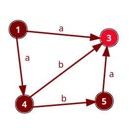
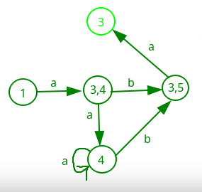

___
## Детерминизация конечного автомата.
> Входные данные: (1,a,3) (1,a,4) (4,a,4) (4,b,3) (4,b,5) (5,a,3)
> Выходные данные: (1,a,34) (34,b,35) (34,a,4) (4,b,35) (4,a,4) (35,a,3)
### Пример детерминизации:

___

## Лексический анализатор.
> Входные данные: for(a:=+10.e212;_value)
> Выходные данные: 

### Входные данные: (1,a,3) (1,a,4) (4,a,4) (4,b,3) (4,b,5) (5,a,3)
### Выходные данные: (1,a,34) (34,b,35) (34,a,4) (4,b,35) (4,a,4) (35,a,3)
___
