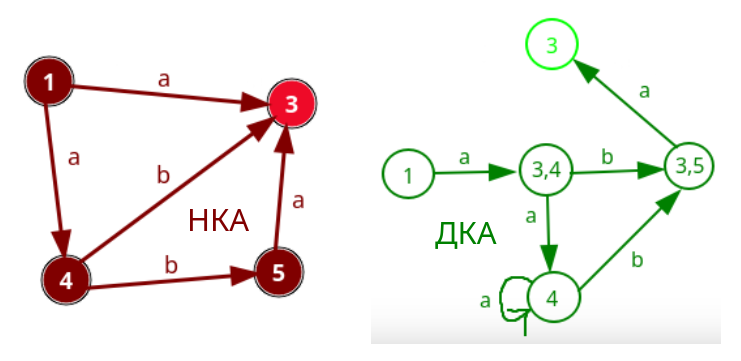

___

# Матрицы
#### Проект в котором я постарался показать все свои знания в c++
##### Features:
* Оптимизация для L1 кэша для квадратных матриц.
```
  template <DEFAULT_TEMPLATE_MATRIX, ENABLE_IF_EQUAL_MATRIX>
  Matrix operator*(const Matrix<DEFAULT_ARGUMENTS_MATRIX> &other) {
    Matrix<Rows, Rows, T> result;
    value_type *rres;
    value_type *rmul1;
    value_type *rmul2;
    for (size_t i = 0; i < _ROWS; i += SM) {
      for (size_t j = 0; j < _ROWS; j += SM) {
        for (size_t k = 0; k < _ROWS; k += SM) {
          rres = result._arr + i * _ROWS + j;
          rmul1 = this->_arr + i * _ROWS + k;
          for (size_t i2 = 0; i2 < SM; ++i2, rres += _ROWS, rmul1 += _ROWS) {
            rmul2 = other._arr + k * _ROWS + j;
            for (size_t k2 = 0; k2 < SM; ++k2, rmul2 += _ROWS) {
              for (size_t j2 = 0; j2 < SM; ++j2) {
                *(rres + j2) += *(rmul1 + k2) * *(rmul2 + j2);
              }
            }
          }
        }
      }
    }

    return result;
  }
```
* Поддержка кастомного аллокатора.
* ~~Динамический полиморфизм~~.
* Статический полиморфизм.
* Использование атрибутов.
* Поддержка move семантики.
* SFINAE.
* Beautiful templates.

___

## Детерминизация конечного автомата.
#### Input data:
> (1,a,3) (1,a,4) (4,a,4) (4,b,3) (4,b,5) (5,a,3)
## Output data:
> (1,a,34) (34,b,35) (34,a,4) (4,b,35) (4,a,4) (35,a,3)
### Determinization case:


___

## Лексический анализатор.
#### Input data:
> for(a:=+10.e212;_value)
#### Output data(таблица лексем и его идентификатора):
|       Lexem       |       Lexeme type     |
|-------------------|:----------------------|
| for               | ID                    |
| (                 | DLM                   |
| a                 | ID                    |
| :=                | ASGH                  |
| +10.e212          | NM                    |
| ;                 | DLM                   |
| _value            | ID                    |
| )                 | DLM                   |

___

## Польская нотация.
#### Input data:
> 123*(1222-12354)*93
#### Output data:
1. > 123 1222 12354 - * 93 *
2. > -127338948

___
